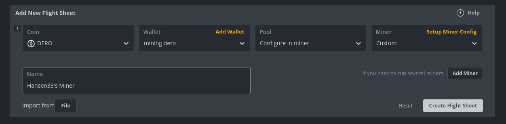

# Hansen33's Miner for HiveOS

Hansen33's Miner is a **high-performance**, closed-source **DERO miner** designed for ease of use and compatibility with various platforms. Built with the latest **AstroBWTv3 algorithm**, it optimizes mining efficiency and ensures the best possible experience for users.

Mining Fee: **Only 2% Fee**

- [Main Page](README.md)

# Features

- Highly optimized AstroBWTv3 algorithm for maximum mining efficiency
- Multi-threaded mining for improved performance on multi-core processors
- Automatic job caching and efficient handling of job updates
- Colorful console output for better readability and user experience
- Detailed hashrate reporting and submitted results tracking
- Easy-to-use command-line interface
- HiveOS Support
- AMD64 and ARM64 Architecture Supported

# Getting Started with HiveOS

## Creating a flight sheet

1. **Add a new Flight Sheet**



2. **Setup Miner Config**

Click the link (**Setup Miner Config**) as seen in the picture above to setup custom miner.

# Flight sheet - Copy Paste Version:

Use the following examples to **Setup Miner Config** for Hansen33's Miner in HiveOS

## Custom configuration

## Miner name
```
hansen33-miner
```

## Installation URL
```
https://dero-node.mysrv.cloud/files/hansen33-miner-hiveos.tar.gz
```

## Hash algorithm
```
    astrobwt
```

## Wallet and worker template
```
%WAL%.%WORKER_NAME%
```

## Pool URL
```
community-pools.mysrv.cloud:10300
```

## Extra config arguments 
```
--mining-threads=[number of threads]
```


### Alternative Pool Port (for closed networks)
## Pool URL
```
community-pools.mysrv.cloud:443
```

### Use own Node
## Pool URL
```
<ip>:<mining-port>
```

# Force Update the Miner from HiveOS Shell

To **force** HiveOS to update your local miner version, run the following command
```bash
/hive/miners/custom/custom-get https://dero-node.mysrv.cloud/files/hansen33-miner-hiveos.tar.gz -f
```
Then restart the miner
```
miner stop
miner start
```

# Check Miner Status

## Miner Log

To see miner log, run this command

```bash
miner log
```

## Screen 

To view miner screen session run following command.
```bash
screen -x -S miner
```

To exit screen use.
Hold **CTRL+A** and press **d**

This will exit screen session.


If mining to own node, consider checking out [Hansen33 Mod](https://github.com/Hansen333/derohe-Hansen33-mod/releases)

👉 As part of the DERO community, I'm committed to delivering the best mining experience possible. I welcome your feedback and suggestions.

👋 Thank you for your continued support, and happy mining!

